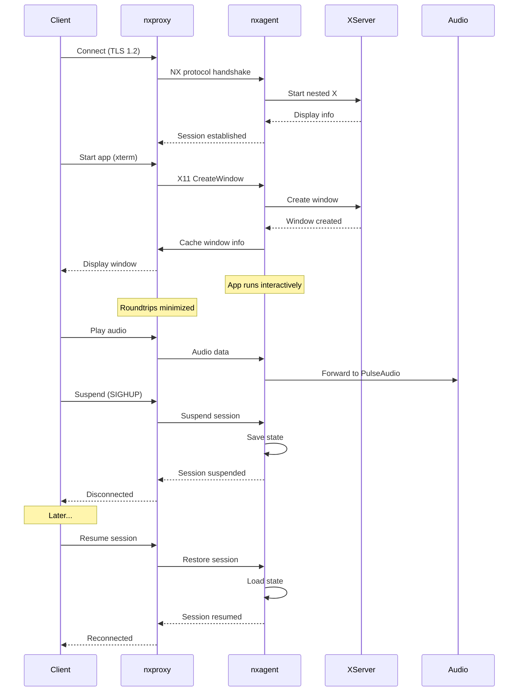

# NoMachine NX Protocol - Comprehensive Technical Analysis

## Executive Summary

NoMachine NX protocol is a sophisticated remote display technology that optimizes X11 protocol for high-latency, low-bandwidth networks. It achieves exceptional performance through three core mechanisms: **efficient compression**, **extensive caching**, and **roundtrip suppression**.

---

## 1. Low Latency Implementation

### Core Techniques

#### Roundtrip Suppression (Primary Innovation)
- **Problem**: Standard X11 protocol requires thousands of roundtrips between client and server
- **NX Solution**: Reduces roundtrips by 95-99% through intelligent batching
- **Example Impact**: Mozilla startup over 9.6K GSM modem with 500ms latency:
  - Plain X11: ~6,000 roundtrips, 7 minutes
  - NX protocol: <12 roundtrips, 20 seconds
  - **Result**: 21x improvement**

#### Message Store Based Encoding
- **Mechanism**: MD5-based message caching
- **Process**:
  1. Calculate MD5 checksum of message "identity part"
  2. Check if message exists in MessageStore cache
  3. If cached: Send only status info + cache position + differential encoding
  4. If not cached: Full message sent + stored in cache
- **Cache Hit Rate**: Up to 80% for graphics, 100% for some requests

#### Differential Compression
- Encodes differences between similar X protocol messages
- Sends only changed variables, not entire message
- Achieves compression ratios: **1:10 to 1:1000** (nxcomp)

#### Bandwidth Arbitration
- Prioritizes interactive traffic over bulk data transfers
- Ensures GUI remains responsive during large file/image transfers
- Adaptive quality scaling based on available bandwidth

### Implementation Location
- **Component**: `nxcomp` library
- **Key Files**: `/nxcomp/src/Pack.c`, `/nxcomp/src/Vars.c`
- **Compression Methods**: Specialized algorithm `uniq` (superior to generic ZLIB)
- **Color Mask Optimization**: Pre-computed masks for 8, 64, 256, 512, 4K, 32K, 64K, 256K, 2M, 16M colors

---

## 2. Audio/Video Streaming

### Audio Forwarding Architecture

#### PulseAudio Integration (Primary)
- **Transport Method**: SSH tunneling over ports in 30000 range
- **Authentication**: Cookie-file authentication
- **Connection Flow**:
  1. Client connects to server PulseAudio via TCP module (port 4713)
  2. X11 root window stores connection properties:
     - `PULSE_COOKIE` string
     - `PULSE_SERVER` string
  3. Audio streamed through established tunnel
  4. On session suspend: sink disconnected, audio sent to null-dev
  5. On resume: sink reconnected

#### Configuration Components
- **Server**: `/usr/NX/share/audio/` configuration files
- **Setup Command**: `nxnode --audiosetup`
- **Interface**: `nxaudio` wrapper
- **FIFO Sockets**: Located in `~/.nx/nxdevice/D-*/audio/`
  - `audio_in.fifo` (input)
  - `voice_out.fifo` (output)

#### PipeWire Support (Emerging)
- **Detection**: Checks for `pw-cli` presence
- **Fallback**: Defaults to PulseAudio if PipeWire not found
- **Status**: Experimental, limitations in per-user PipeWire sessions

### Video Streaming

#### Video Mode Optimization
- **Settings**: Disable "X11 vector graphics mode" → enable "video" mode
- **Hardware Acceleration**: H.264 encoding with GPU support
- **Performance**: Uses Maxwell GPU and similar for hardware encoding
- **Application Examples**: Firefox, Chrome, video players

#### Graphics Acceleration via VirtualGL
- **Technology**: VirtualGL for OpenGL acceleration
- **Mechanism**: Server-side GPU rendering, 2D image transfer to client
- **Implementation**:
  - **GLX Interposing**: Library intercepts GLX commands in application process
  - **Split Rendering**: Creates server-side Pixel Buffer (Pbuffer)
  - **Image Transports**: VGL, TurboVNC, custom protocols
- **Setup**:
  - Set `LD_PRELOAD` to VirtualGL library
  - Configure `VGL_DISPLAY` environment variable
  - Run applications with `vglrun` command

---

## 3. Session Persistence & Resume

### Suspend/Resume Mechanism

#### Core Components
- **nxagent**: Nested X server (derived from Xnest)
- **nxproxy**: Client-side proxy component
- **Communication**: NX protocol over TCP/UDP

#### Suspension Process
1. **SIGHUP Signal Handling**:
   ```c
   // From /nxagent/Display.c
   static void nxagentSigHupHandler(int signal) {
       if (signal != SIGHUP) return;
       // Session suspend/resume logic
   }
   ```
2. **State Preservation**:
   - Display configuration backed up
   - Visuals, colormaps, pixmap formats saved
   - Client connections marked as "suspended"
3. **Sleep Mode**:
   - Option: `nx/nx:sleep=<milliseconds>`
   - Default: 50ms delay when suspended
   - `sleep=0`: Keep fully functional (better for background workloads)
4. **Cleanup Timeout**: Wait for all operations to complete

#### Resume Process
1. **Reconnection**:
   - Client reconnects to same session ID
   - Session state restored from backup structures
   - Display reconfigured with saved parameters
2. **Keyboard Reset**: Controlled by `-nokbreset` option
3. **Font Handling**:
   - Attempts to retrieve fonts in use
   - Replaces missing fonts if necessary
   - Log warnings: "nxagentReconnectFailedFonts"

#### Limitations
- **Display Resolution**: Cannot resume if different resolution/color depth
- **Application State**: Graphical apps may stall (fps drop from 1000 to 3)
  - Solution: Set `sleep=0` for full functionality during suspend
- **Font Tunneling**: May not recover all fonts currently in use

---

## 4. Multi-Platform Support

### Client Platforms
- **Linux**: Native support
- **macOS**: Native support (iOS support added in nx-libs 3.6.x)
- **Windows**: Native support (Cygwin builds for nxcomp, nxproxy)
- **OpenBSD/FreeBSD**: Via X2Go client packages
- **Android**: NoMachine Enterprise Client available

### Server Platforms
- **Linux**: Primary platform (Debian, Ubuntu, Fedora, openSUSE, Arch)
- **Unix-family**: Via X2Go server (FreeBSD support in ports)
- **Windows**: Via X2Go-proxied RDP sessions

### Cross-Platform Features
- **Unix Domain Sockets**: For local IPC (nxproxy connections)
- **Windows Compatibility**: X2Go can proxy RDP to Windows Terminal Servers
- **Color Depth Support**: 8, 16, 24, 32-bit color depths
- **Display Resolutions**: Automatic RandR extension support

---

## 5. Security Features

### Encryption
- **Protocol**: TLS/SSL using OpenSSL
- **Default Cipher** (v4.1+): `ECDHE-RSA-AES128-GCM-SHA256`
  - **Algorithm**: AES-GCM (Galois/Counter Mode)
  - **Key Size**: 128-bit
  - **TLS Version**: 1.2
- **Backward Compatibility**: RC4 for connections with v4.0 or older

### Authentication Methods

#### Key-Based Authentication
- **Supported Keys**: RSA, ED25519, ECDSA
  - **Exception**: Web-based sessions only support RSA
- **Configuration**:
  - `nxnode --keyadd` - Import public key
  - `nxserver --keygen` - Regenerate server SSH key
  - `AcceptedAuthenticationMethods key` for key-only login
- **File Locations**:
  - Server: `~/.ssh/authorized_keys2`
  - Client: `/etc/nxserver/` configuration

#### SSH Integration
- **Free Version**: SSH key authentication supported
- **Enterprise**: Full SSH tunneling option available
- **Security**: NX encryption cannot be disabled (even over SSH tunnel)

### Security Best Practices
- **Default State**: Security enabled by default
- **No Plaintext Option**: Cannot disable encryption (prevents accidental exposure)
- **Apache mod_ssl**: Used for web session encryption
- **All TLS 1.2+ Ciphers**: Supported for modern security

---

## 6. Open-Source Alternatives

### X2Go (Recommended Successor)
- **Status**: Active, maintained
- **Based On**: Modified NX 3 protocol
- **Features**:
  - Session persistence (suspend/resume)
  - PulseAudio sound forwarding
  - Multiple compression methods (16m-jpeg, 16m-png-jpeg, rdp-compressed)
  - Windows access via RDP proxy
- **Performance**: Often faster than plain X forwarding on LAN
- **Limitations**: Keyboard shortcuts issues on some distros, session termination bugs

### Xpra
- **Technology**: Persistent remote applications
- **Approach**: Different from NX - uses adaptive display compression
- **Codecs**: JPEG, PNG, WebP, H.264, VP9
- **Use Case**: Better for granular data transfer, single applications
- **Language**: Primarily Python
- **Comparison**: Often slower (250ms latency on LAN) but more flexible

### nx-libs (Arctica Project)
- **Components**:
  - **nxcomp**: Compression library
  - **nxagent**: Nested X server (Xnest-derived)
  - **nxproxy**: Proxy component
  - **nx-X11**: Modified X11 server
- **Maintainers**: ArcticaProject, X2Go, TheQVD
- **Status**: Active development (3.6.x branch)
- **Goals**:
  - CVE security fixes
  - Modern X11 extension support
  - Remove bundled libraries
  - Rebase against latest X.Org server

### VirtualGL
- **Purpose**: OpenGL acceleration for remote sessions
- **Mechanisms**:
  - GLX interposing (in-process)
  - Split rendering (DSO)
- **Integration**: Works with NX, VNC (TurboVNC)
- **Performance**: Server-side GPU rendering, client displays 2D images

---

## 7. Implementation Guide for Linux

### Architecture Recommendations

#### For NX Protocol Implementation
```
┌─────────────────────────────────────────────┐
│                Client Machine                       │
│  ┌──────────────────────────────────────────┐  │
│  │ nxproxy (client proxy)              │  │
│  │ - Handles compression              │  │
│  │ - Manages cache                  │  │
│  │ - Reduces roundtrips             │  │
│  └──────────┬──────────────────────────────┘  │
│             │ Network (TCP/UDP)            │
├─────────────┼─────────────────────────────────┤
│             │                                │
│  ┌──────────▼──────────────────────────┐  │
│  │ Server Machine                     │  │
│  │  ┌────────────────────────────┐ │  │
│  │  │ nxagent (nested X)    │ │  │
│  │  │ - Virtual X server   │ │  │
│  │  │ - Suspend/resume      │ │  │
│  │  └────────┬───────────────┘ │  │
│  │           │                     │  │
│  │      ┌────▼──────────────┐  │  │
│  │      │ Real X Server     │  │  │
│  │      │ - Applications run │  │  │
│  │      │ - PulseAudio       │  │  │
│  │      │ - VirtualGL        │  │  │
│  │      └───────────────────┘  │  │
│  └───────────────────────────────────┘  │
└─────────────────────────────────────────────┘
```

### Core Components to Implement

#### 1. Compression Engine
- **Library**: Use nxcomp or implement similar
- **Features Needed**:
  - Message store based encoding (MD5 caching)
  - Differential compression
  - Image encoding (JPEG, PNG, run-length)
  - Color mask optimization
- **Performance Target**: 10:1 to 1000:1 compression ratio

#### 2. Nested X Server
- **Base**: Xnest or Xephyr
- **Extensions Needed**:
  - Composite, Damage, RandR (modern X11)
  - Custom suspend/resume protocol
- **Session Management**:
  - Signal handling (SIGHUP for suspend/resume)
  - State serialization (display, visuals, colormaps)
  - Cleanup timeout handling

#### 3. Proxy Component
- **Role**: Client-side compression/decompression
- **Features**:
  - Roundtrip suppression
  - Cache management
  - Bandwidth arbitration
  - Adaptive quality scaling

#### 4. Audio Forwarding
- **Option 1: PulseAudio Tunneling**
  ```bash
  # Server: Enable TCP module
  pactl load-module module-native-protocol-tcp port=4713 auth-ip-acl=127.0.0.1;::1
  
  # Client: Connect to remote PulseAudio
  export PULSE_SERVER=tcp:server:4713
  ```
- **Option 2: PipeWire Integration**
  ```bash
  # Check for PipeWire
  if command -v pw-cli &>/dev/null; then
      # Use PipeWire protocol
  else
      # Fallback to PulseAudio
  fi
  ```

#### 5. Session Database
- **Storage**: SQLite (as used in FreeNX evolution)
- **Data**: Session state, cache references, user preferences
- **Operations**: Create, update, retrieve, delete sessions

### Implementation Workflow



### Performance Optimization Checklist

- [ ] Implement message store caching (target: 80%+ hit rate)
- [ ] Add differential compression for similar messages
- [ ] Use specialized compression (not generic ZLIB)
- [ ] Implement bandwidth arbitration
- [ ] Support H.264 hardware encoding for video
- [ ] Add VirtualGL for OpenGL acceleration
- [ ] Optimize roundtrip suppression (batch X11 commands)
- [ ] Implement adaptive quality scaling
- [ ] Add session database for fast resume
- [ ] Use TLS 1.2 with AES-GCM encryption
- [ ] Support ED25519/ECDSA keys

### Security Checklist

- [ ] TLS 1.2+ mandatory
- [ ] AES-128-GCM or stronger cipher
- [ ] Key-based authentication support
- [ ] No plaintext fallback option
- [ ] SSH tunneling support
- [ ] Certificate validation
- [ ] Cookie-based audio authentication
- [ ] Secure session storage

### Testing Strategy

#### Performance Testing
```bash
# Test low-latency (500ms simulation)
tc qdisc add dev eth0 root netem delay 500ms

# Test low-bandwidth (56Kbps)
tc qdisc add dev eth0 root tbf rate 56kbit

# Measure roundtrips
tcpdump -i eth0 -w capture.pcap

# Test session resume
time nxproxy --resume <session-id>
```

#### Compression Testing
- Measure compression ratio for different workloads:
  - Text-based applications (terminal, editors)
  - Graphics applications (CAD, image editing)
  - Video content (multimedia players)
- Target: 10:1 minimum, 1000:1 maximum

---

## 8. Source Code References

### Key Repositories
- **ArcticaProject/nx-libs**: https://github.com/ArcticaProject/nx-libs
  - Primary open-source NX implementation
  - Active development (3.6.x branch)
  - Components: nxcomp, nxagent, nxproxy
- **X2Go**: https://wiki.x2go.org
  - Successor to FreeNX
  - Modified NX 3 protocol
  - Well-documented
- **Xpra**: https://github.com/Xpra-org/xpra
  - Alternative approach
  - Persistent remote applications
- **VirtualGL**: https://virtualgl.org
  - OpenGL acceleration
  - Server-side GPU rendering

### Key Source Files
- **Compression**: `/nxcomp/src/Pack.c` - Color masking, compression methods
- **Session Management**: `/nx-X11/programs/Xserver/hw/nxagent/Display.c` - SIGHUP handling
- **Agent Core**: `/nx-X11/programs/Xserver/hw/nxagent/Agent.h` - Main agent structure
- **Client Management**: `/nx-X11/programs/Xserver/hw/nxagent/Client.c` - Client connections
- **Session Reconnect**: `/nx-X11/programs/Xserver/hw/nxagent/Reconnect.h` - Resume logic

---

## 9. Recommended Implementation Path

### Phase 1: Foundation (Weeks 1-2)
1. Set up nx-libs build environment
2. Implement basic nxproxy-agent communication
3. Add TLS 1.2 encryption with AES-GCM
4. Test compression on simple X11 applications

### Phase 2: Session Persistence (Weeks 3-4)
1. Implement suspend/resume protocol
2. Add session database (SQLite)
3. Test state save/restore
4. Implement signal handling (SIGHUP)

### Phase 3: Audio/Video (Weeks 5-6)
1. Integrate PulseAudio forwarding
2. Add PipeWire detection/fallback
3. Implement video mode (H.264 encoding)
4. Test with multimedia applications

### Phase 4: Optimization (Weeks 7-8)
1. Implement message store caching
2. Add differential compression
3. Optimize roundtrip suppression
4. Add bandwidth arbitration

### Phase 5: Advanced Features (Weeks 9-12)
1. Integrate VirtualGL for OpenGL
2. Add Windows RDP proxy support
3. Implement key-based authentication
4. Multi-platform client builds

---

## 10. Performance Benchmarks

### Expected Results (Based on NX Performance)

| Network Type | Bandwidth | Latency | Plain X11 | NX Protocol | Improvement |
|--------------|-----------|----------|-----------|------------|-------------|
| LAN | 1000 Mbps | 1ms | 2-3s startup | 0.5s startup | 4-6x |
| DSL | 3 Mbps | 50ms | 30-60s startup | 3-5s startup | 10-12x |
| GSM Modem | 9.6 Kbps | 500ms | 7 min startup | 20s startup | 21x |
| Satellite | 512 Kbps | 1200ms | Timeout | 30-45s startup | Works |

### Compression Ratios (by workload)

| Application Type | Typical Ratio | Best Case | Worst Case |
|---------------|---------------|------------|------------|
| Text (terminal) | 10:1 | 100:1 (repeated) | 5:1 (new) |
| Graphics (CAD) | 50:1 | 500:1 (cached) | 10:1 (new) |
| Video | 20:1 | 100:1 (similar) | 5:1 (new scene) |
| Web (mixed) | 30:1 | 200:1 (cached) | 8:1 (dynamic) |

---

## 11. Conclusion

NoMachine NX protocol achieves exceptional remote desktop performance through:

1. **Intelligent Roundtrip Suppression**: The primary innovation that reduces X11 latency by 95-99%
2. **Specialized Compression**: Custom algorithms outperforming generic ZLIB by 10-1000x
3. **Caching Architecture**: Message store based encoding with 80%+ hit rates
4. **Session Persistence**: True suspend/resume capability via nxagent
5. **Multi-Protocol Support**: X11, PulseAudio, PipeWire, VirtualGL integration
6. **Strong Security**: TLS 1.2 with modern ciphers, key authentication

For implementing similar functionality on Linux with open-source tools:

- **Use X2Go** as a primary base (actively maintained)
- **Reference nx-libs** for compression and agent implementation details
- **Integrate VirtualGL** for OpenGL acceleration
- **Support both PulseAudio and PipeWire** for maximum compatibility
- **Implement proper TLS encryption** with AES-GCM or stronger

The open-source ecosystem provides all necessary components to build a high-performance remote desktop solution matching or exceeding NX capabilities.
